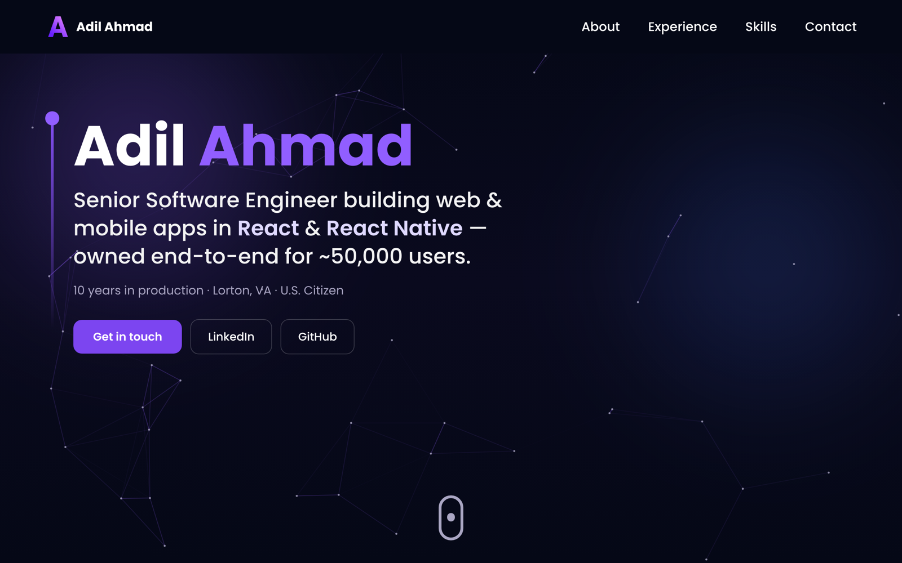

# Adil Ahmad — Developer Portfolio

[](https://github.com/Dev-Adil/Portfolio/actions/workflows/ci.yml)


A fast, accessible, single-page portfolio for a senior software engineer — built to load in
well under a second on mobile and to read clearly in the ~30 seconds a recruiter actually
spends on it. **Live: [adil-ahmad.com](https://adil-ahmad.com)**



> **Note on the repo name:** this started life as a 3D portfolio (Three.js). v2.0 deliberately
> removed all WebGL in favor of a lightweight, performance-first build — see
> [Performance](#performance) below for why and the numbers.

## Stack

| Area | Choice |
|------|--------|
| UI | React 18 + TypeScript (strict) |
| Styling | Tailwind CSS + a few hand-rolled CSS effects |
| Animation | Framer Motion (scroll reveals) + a 2D `<canvas>` constellation |
| Build | Vite 5 (manual chunks, Brotli + Gzip, PWA) |
| Contact | EmailJS (lazy-loaded) with an invisible honeypot |
| Tests | Vitest + React Testing Library |
| Hosting | Static (Netlify / Cloudflare Pages / Vercel) |

No UI framework, no component library, no 3D engine — the goal was a small, legible codebase.

## Performance

The original version shipped ~922 KB of Three.js plus ~72 MB of 3D assets (an Earth GLTF, a
dozen WebGL canvases) for purely decorative effect. v2.0 cut all of it. Measured with
Lighthouse (mobile, simulated throttling):

| Metric | v1 (3D) | v2.0 |
|---|---|---|
| Lighthouse Performance | 63 | **91** |
| Accessibility / Best-Practices / SEO | 90 / 93 / 100 | **100 / 100 / 100** |
| Largest Contentful Paint (throttled) | **164 s** | **2.7 s** |
| Initial JS (brotli) | ~272 KB | **~97 KB** |
| Total page weight | **79 MB** | **1.3 MB** |
| WebGL contexts | up to ~15 | **0** |

Visual interest now comes from cheap, GPU-friendly effects that cost ~0 on the main thread:
a 2D constellation canvas ([`HeroBackdrop.tsx`](src/components/HeroBackdrop.tsx)) that pauses
off-screen and goes static under `prefers-reduced-motion`, a CSS aurora, animated count-up
stats, and a gradient-border contact panel.

## Architecture

Single page, no router. [`src/App.tsx`](src/App.tsx) lazy-loads each section for code
splitting:

```
Hero (+ constellation canvas) → Stats → About → Experience → Skills → Education → Contact → Footer
```

- **Sections** live in `src/components/`. Each is wrapped by
  [`hoc/SectionWrapper.tsx`](src/hoc/SectionWrapper.tsx), which adds a scroll-triggered Framer
  Motion reveal and an `id` anchor for the navbar.
- **Content is data, not markup.** All copy/links live in
  [`src/constants/index.ts`](src/constants/index.ts) (`profile`, `services`, `skillGroups`,
  `experiences`, `education`, `certifications`) — edit content there, not in components.
- **Reduced motion / a11y** is centralized: [`utils/performance.ts`](src/utils/performance.ts)
  exposes `prefersReducedMotion()`, and every animation respects it.
- **Custom CSS effects** (`gradient-text`, `hero-aurora`, `gradient-border`, `texture-dots`)
  live in [`src/index.css`](src/index.css); design tokens in `tailwind.config.cjs` +
  [`src/style.ts`](src/style.ts).

```
src/
├── components/        # Hero, HeroBackdrop, Stats, About, Experience, Tech (Skills),
│                      # Education, Contact, Footer, Navbar, ErrorBoundary, icons
├── constants/         # All site content (single source of truth)
├── hoc/               # SectionWrapper
├── utils/             # performance, motion variants, useInView, logger
├── test/              # Vitest setup
├── App.tsx · main.tsx · index.css
public/                # _headers, .htaccess, robots.txt, sitemap.xml, og-image.jpg, logo
```

## Getting started

```bash
git clone https://github.com/Dev-Adil/Portfolio.git
cd Portfolio
npm install

cp .env.example .env     # then fill in your EmailJS keys (optional — only the form needs them)
npm run dev              # http://localhost:5173
```

### Scripts

| Script | Purpose |
|--------|---------|
| `npm run dev` | Vite dev server |
| `npm run build` | Production build → `dist/` |
| `npm run preview` | Serve the production build locally |
| `npm run test` | Run the Vitest suite |
| `npm run test:coverage` | Tests with a coverage report |
| `npm run lint` / `lint:fix` | ESLint |
| `npm run typecheck` | `tsc --noEmit` |
| `npm run format` / `format:check` | Prettier |
| `npm run build:analyze` | Build + `dist/stats.html` bundle visualization |

## Testing

[Vitest](https://vitest.dev/) + React Testing Library, jsdom environment. Coverage focuses on
real logic: contact-form validation and honeypot behavior, the `useInView` and
`prefersReducedMotion` utilities, a render smoke test, and content sanity checks.

```bash
npm run test
npm run test:coverage
```

## Security

- **Strict CSP** (`script-src 'self'`, `object-src 'none'`, `frame-ancestors 'none'`,
  `upgrade-insecure-requests`) plus HSTS, `X-Content-Type-Options`, `X-Frame-Options`,
  `Referrer-Policy`, and a restrictive `Permissions-Policy` — see `public/_headers`.
- **No `eval`, no `dangerouslySetInnerHTML`, no `innerHTML`.** External links use
  `rel="noopener noreferrer"`.
- **Contact form:** client-side validation + length caps, an **invisible honeypot** that
  silently drops bot submissions, and EmailJS *Allowed Origins* restricting the sender. The
  EmailJS public key is exposed by design (it's a publishable key); origin-locking is the
  intended mitigation.
- **Secrets** stay in `.env` (git-ignored); only `VITE_*` build-time values reach the client.

## Accessibility

WCAG-minded: semantic landmarks, labeled form controls with `aria-describedby` errors,
visible focus rings, full keyboard navigation, and `prefers-reduced-motion` honored across
every animation (the hero canvas renders a single static frame). Lighthouse Accessibility:
100.

## Deployment

Static build — deploy `dist/` to any static host. On Netlify / Cloudflare Pages, `public/_headers`
applies the security + caching headers automatically; set the `VITE_EMAILJS_*` variables in the
host's dashboard.

## License

Copyright © 2026 Adil Ahmad. All rights reserved — published as a public work sample, not
licensed for reuse. See [LICENSE](LICENSE).

## Author

**Adil Ahmad** — Senior Software Engineer
[adil-ahmad.com](https://adil-ahmad.com) · [LinkedIn](https://linkedin.com/in/adilahmadgmu) ·
[GitHub](https://github.com/dev-adil)
